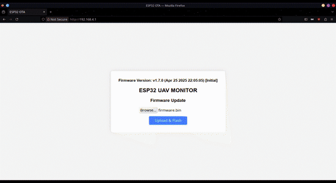
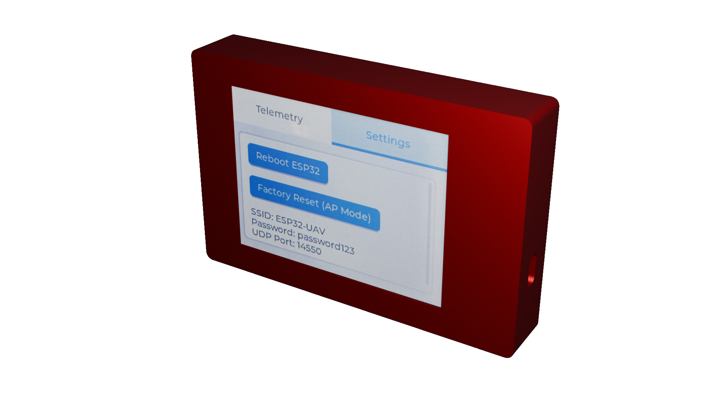
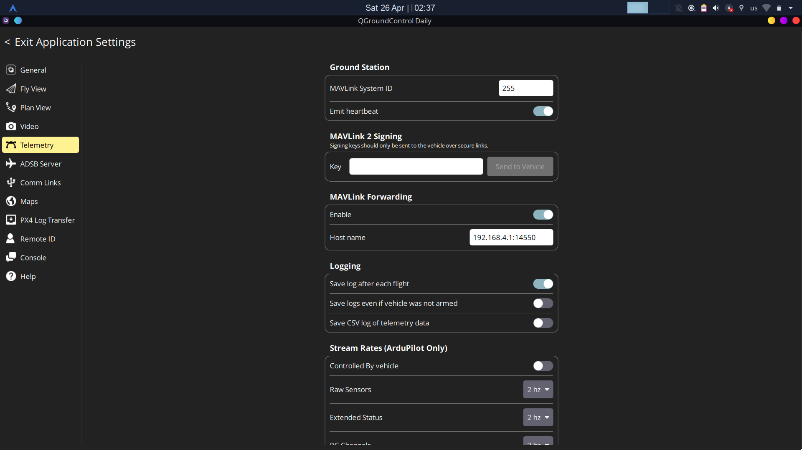
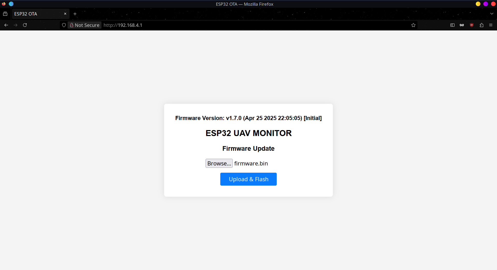
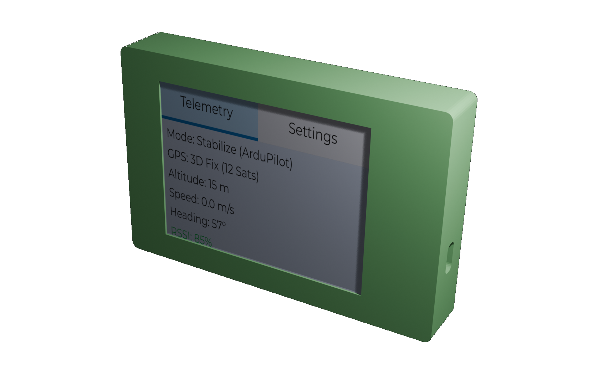
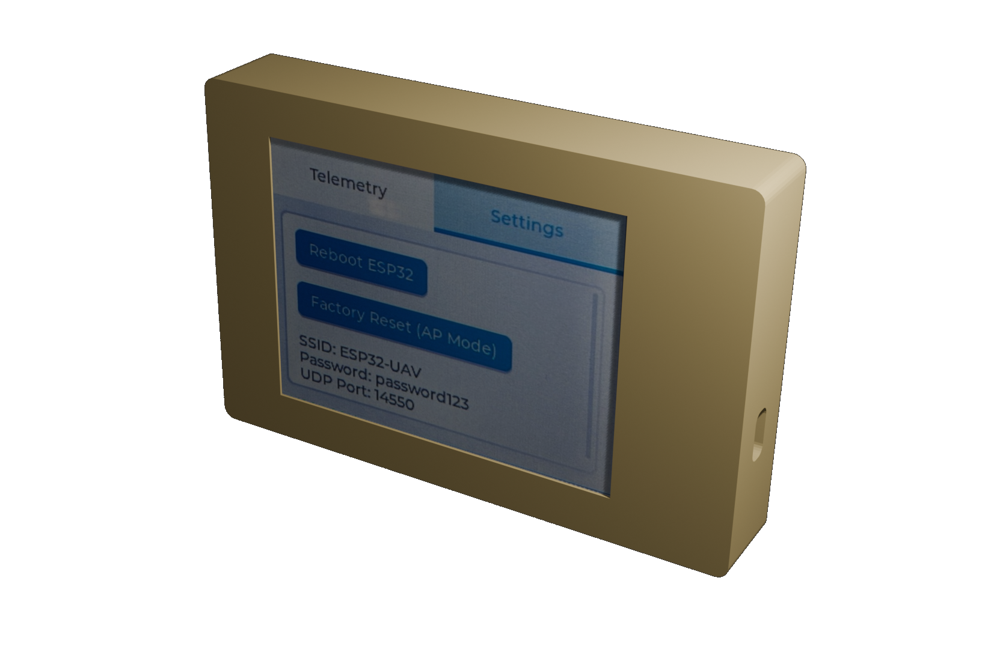
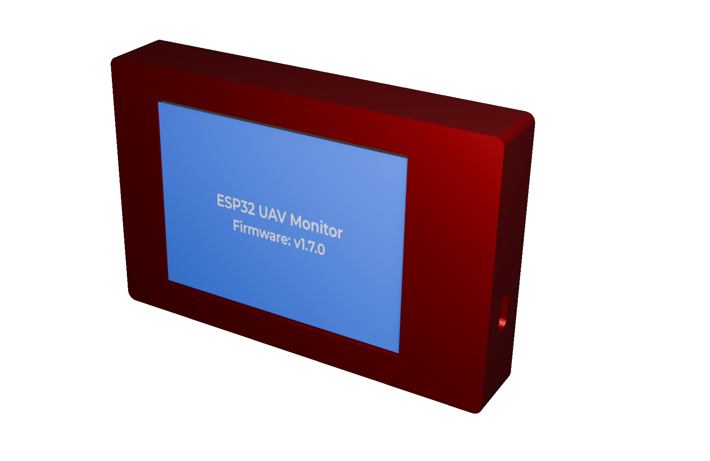
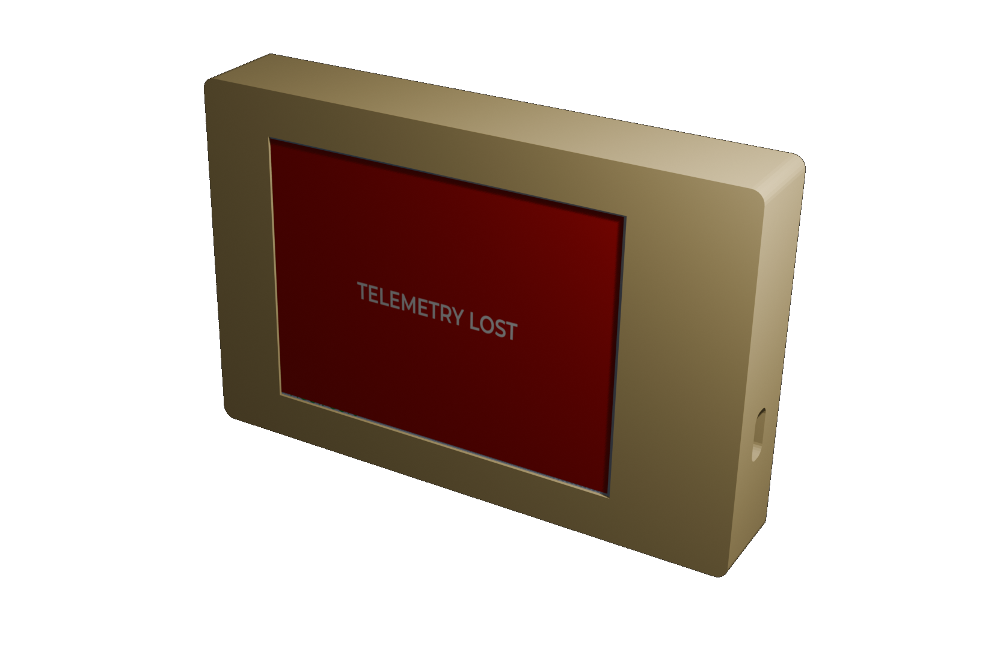

# ESP32 UAV Telemetry Monitor

<p align="center">
  
</p>

<p align="center">
  
</p>

## Overview

**ESP32 UAV Telemetry Monitor** is a lightweight wireless telemetry screen that connects to your UAV’s MAVLink telemetry stream over WiFi.

It displays:
- Flight Mode
- GPS Status and Satellites
- Altitude (meters)
- Ground Speed (m/s)
- Heading (degrees)
- RSSI (signal strength)

It also supports:
- **OTA (Over-the-Air) Firmware Updates** via a simple Web UI
- **Factory Reset** (reboot into default AP mode)
- **Automatic Telemetry Lost Warning** (shows a red warning screen if no data is received)

## Features

✅ Wireless connection (WiFi AP mode)  
✅ Receives MAVLink telemetry (UDP port 14550)  
✅ Modern LVGL-based GUI (ILI9341 SPI displays)  
✅ OTA Web Upload for firmware updates  
✅ Factory Reset button  
✅ Compact, portable monitor for field operations  
✅ Low latency telemetry updates

## Hardware Requirements

- ESP32 Dev Board (recommended: ESP32 WROOM/WROVER modules)
- ILI9341 2.8" or 3.2" TFT Display (SPI connection)
- Touch screen support

## How It Works

- ESP32 starts its own WiFi Access Point `ESP32-UAV` (password `password123`).
- Opens UDP port `14550` to receive MAVLink packets.
- If no telemetry is received for 5 seconds → displays **TELEMETRY LOST** warning.
- OTA firmware upload possible if BOOT button held at startup.

## Connectivity Options

### 1. **QGroundControl (MAVLink Forwarding)**

- Open QGroundControl
- Go to **Application Settings → MAVLink → Forwarding**
- Add Forwarding Address:
  ```
  192.168.4.1:14550
  ```
<p align="center">
  
</p>

✅ QGC now mirrors telemetry to the ESP32 Telemetry Monitor.

### 2. **MAVProxy (Custom MAVLink Output)**

If using MAVProxy, add an output:

```bash
mavproxy.py --master=/dev/ttyUSB0 --out=udpout:192.168.4.1:14550
```

✅ Sends live MAVLink telemetry wirelessly to ESP32 monitor.

## Screenshots

<div style="overflow-x: auto; white-space: nowrap;">







</div>


## Firmware Upload (OTA Update)

- Connect to `ESP32-UAV` WiFi.
- Open browser:
  ```
  http://192.168.4.1/
  ```
- Upload `.bin` firmware.
- ESP32 updates and reboots automatically.

## Building and Flashing

### Using PlatformIO

```bash
git clone https://github.com/YourUsername/esp32-uav-telemetry-monitor.git
cd esp32-uav-telemetry-monitor
pio run --target upload
```

### Using Arduino IDE

- Open `src/main.cpp`
- Select your ESP32 board
- Install Libraries:
  - `lvgl`
  - `WiFi`
  - `Preferences`
  - `ESPAsyncWebServer`
- Upload firmware

## Roadmap

- [x] Wireless MAVLink Telemetry Display
- [x] OTA Web Update
- [x] Touchscreen support
- [ ] Additional future improvements

## Related Projects

**FC Plus** is a modular add-on board for UAV flight controllers, offering advanced features such as telemetry, GPS, object avoidance (ToF, Sonar, IR), and LED indicators for status feedback.

<div align="center">

[](https://github.com/Paschalis/fc-plus-sensor-module)  
[](https://github.com/Paschalis/fc-plus-sensor-module/stargazers) [](https://github.com/Paschalis/fc-plus-sensor-module/network/members) [](https://github.com/Paschalis/fc-plus-sensor-module/commits/main)

</div>

## Acknowledgements

- [LVGL](https://lvgl.io/) for the beautiful GUI framework.
- [MAVLink](https://mavlink.io/en/) communication protocol.
- [ESPAsyncWebServer](https://github.com/me-no-dev/ESPAsyncWebServer) for OTA.

## License

This project is licensed under the [GPLv3 License](https://opensource.org/licenses/GPL-3.0) - see the [LICENSE](LICENSE) file.

---

**Thank you for using ESP32 UAV Telemetry Monitor!**

